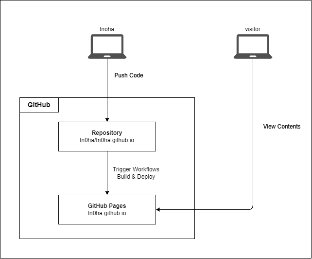

# はしがき

学んだことをメモできる環境が欲しいと思い、HugoとGitHub Pagesを使ってサイトを構築しました。  
大体こういうサイトって最初の投稿は、このサイトをどう構築したのかっていうものになりますよね。  
なのでそれを書き残します。

まず、ツール選定に当たってはChatGPTに力を借りました。  
今まで静的サイトジェネレーターのようなツールには触れてこなかったので、どんなツールがあるか知らないということもあり。  

要望は以下  
- 内容はMarkdownで書きたい
- できればブログサービスを使うのではなく、自分でツールを使い管理したい

そう聞くとGhostやJekyllやHugoがあるよって教えてもらい、軽量さや扱いやすさを加味してHugoにしました。  
Hugoで作った静的サイトのホスト先はNetlifyがメジャーなようですが、無料といえど利用するサービスを増やしたくなかったので、
GitHub Pagesにホストしてもらうことにしました。

# 構成

GitHubにコード一式（Hugoでビルドした後の`public/`配下のファイルではありません）を置いておき、  
mainブランチの変更をトリガーとしてワークフローを回しビルド、そのままPagesにデプロイします。

図にすると以下のような感じ。非常にシンプル。

この構成で使っているサービスはすべて無料で使えます。ありがたい。

静的サイトジェネレータ+ホスティングサービスでサイトを作る場合、通常であれば開発環境などで一度ビルドし、
生成物をホスト先にアップロードするという方法になると思います。  
ですが今回の構成では、ビルドとアップロードをワークフローが担ってくれるので、手元でビルドする手間が省かれているところも大きなポイントです。

# 構築、公開

具体的なコマンドや構築手順については既に様々な記事があるので、ここでは省略します。
おおよそ、以下のことをすれば構築は完了します。  

- GitHubにリポジトリを作り、開発環境にクローン  
- 開発環境にHugoをインストール、ローカルリポジトリでサイトを作成  
- テーマを適用  
- Hugoを設定  
- GitHubリポジトリでPagesを有効化、デプロイ方法はGitHub Actionsにする  
- デプロイ用のワークフローを作成  
- コードをPush  

なお、GitHubのリポジトリはPublicにする必要があるので、そこを気にする人は注意してください。

## Hugoのテーマ

Hugoはテーマと呼ばれるデザインのテンプレートが用意されており、適用させるテーマによってサイトの外観を変えることができます。  
自分は [PaperMod](https://themes.gohugo.io/themes/hugo-papermod/) を使うことにしました。
最初に参考にした記事で使っていたのがそれで、パッと見で良いなと感じたので特に深く考えず決めました。  

ただ、ドキュメントを読む中で知ったのですが、PaperModはFuse.jsによるページの検索機能が標準でついており、
特に自分で設定しなくてもFuse.jsを使えます。検索はおいおい実装しようと思っていたので、これは嬉しい誤算でした。

## 参考URL
構築にあたっては以下の記事を参考にしました。

- [Hugo+Github Pagesでプロフィールページを作ってみた](https://zenn.dev/okaponta/articles/c302f58507febc)
- [PaperMod's wiki](https://github.com/adityatelange/hugo-PaperMod/wiki)
- [Hugo - Host on GitHub Pages](https://gohugo.io/host-and-deploy/host-on-github-pages/)

公式サイトに載っているGitHub PagesでデプロイするためのGitHub ActionsのワークフローのYAMLは、そのままコピペして使えます。

# 今後について

一旦、サイトを公開して記事を投稿できるようになったので、やりたいことはできるようになりました。

今後は記事を投稿する以外にも、このサイトの利便性を向上や内容を充実させるための取り組みもしていきたいと思います。  
とりあえずぱっと思いつくものだと以下
- Faviconを設定する
- Aboutページを作る
- 検索エンジンでこのサイトが表示されるようにする
- Google Analyticsでアクセス情報の分析をできるようにする

そんな感じでよろしくお願いします。
