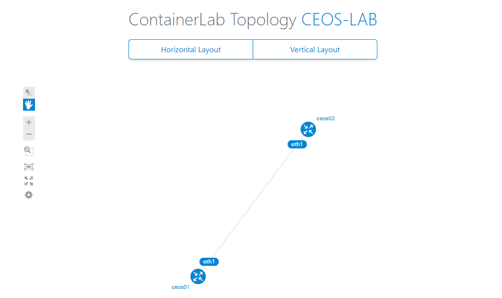
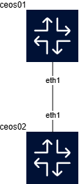

# はじめに

containerlabでコンテナルータを並べ、EVPNによるL2VPNネットワークを構築します。  
少しずつ進めます。  
今回はまず、containerlab(clab)でコンテナルータを動かし、疎通を取るところまでやります。  

# 環境

- Ubuntu 24.04
- Docker 28.1.1
- contaierlab 0.68.0
- cEOS 4.34.0F

UbuntuはVMware Workstation Proの上に立てたVM。  
Ubuntu 24.04は、OSインストールの時についでにDockerをインストールできるが、そこではインストールせずに
[get.docker.com](https://github.com/docker/docker-install)からインストールスクリプトを落としてインストールした。  

containerlabは[ここ](https://containerlab.dev/install/)のページのquick setup scriptを実行してインストール。  

# containerlab環境構築

## デプロイ
まずcEOSをインポートする。cEOSは64bitバージョンを用意する。  
```shell
$ docker import cEOS64-lab-4.34.0F.tar ceos:4.34.0F
```

`docker images`コマンドでインポートしたコンテナイメージが見えるはず。  
```shell
$ docker images
REPOSITORY   TAG       IMAGE ID       CREATED          SIZE
ceos         4.34.0F   d57058cac628   21 seconds ago   2.49GB
```

---

次はトポロジファイルを作る。  
cEOSを2つ並べ、1本のリンクを張るすごく単純な構成を取ります。  

```yaml
name: ceos-lab

topology:
  kinds:
    ceos:
      image: ceos:4.34.0F

  nodes:
    ceos01:
      kind: ceos
    ceos02:
      kind: ceos

  links:
    - endpoints: ["ceos01:eth1", "ceos02:eth1"]
```

---

コンテナイメージとトポロジファイルが用意できたら、下記コマンドでデプロイできる。  
```shell
$ clab deploy -t ceos-lab.yaml
```

参考に実行時のログ。（一部文字化けしている箇所がある）  
```shell
$ clab deploy -t ceos-lab.yaml
06:29:18 INFO Containerlab started version=0.68.0
06:29:18 INFO Parsing & checking topology file=ceos-lab.yaml
06:29:18 INFO Creating docker network name=clab IPv4 subnet=172.20.20.0/24 IPv6 subnet=3fff:172:20:20::/64 MTU=1500
06:29:18 INFO Creating lab directory path=/home/tnoha/clab/ceos-lab/clab-ceos-lab
06:29:18 INFO Creating container name=ceos01
06:29:18 INFO Creating container name=ceos02
06:29:19 INFO Running postdeploy actions for Arista cEOS 'ceos02' node
06:29:19 INFO Created link: ceos01:eth1 <--> ceos02:eth1
06:29:19 INFO Running postdeploy actions for Arista cEOS 'ceos01' node
06:29:35 INFO Adding host entries path=/etc/hosts
06:29:35 INFO Adding SSH config for nodes path=/etc/ssh/ssh_config.d/clab-ceos-lab.conf
l----------------------w--------------w---------w-------------------k
|         Name         |  Kind/Image  |  State  |   IPv4/6 Address  |
t----------------------n--------------n---------n-------------------u
| clab-ceos-lab-ceos01 | ceos         | running | 172.20.20.3       |
|                      | ceos:4.34.0F |         | 3fff:172:20:20::3 |
t----------------------n--------------n---------n-------------------u
| clab-ceos-lab-ceos02 | ceos         | running | 172.20.20.2       |
|                      | ceos:4.34.0F |         | 3fff:172:20:20::2 |
m----------------------v--------------v---------v-------------------j
```

`clab inspect`コマンドでデプロイした環境の状態を確認できる。  
```shell
$ clab inspect -t ceos-lab.yaml
06:36:34 INFO Parsing & checking topology file=ceos-lab.yaml
l----------------------w--------------w---------w-------------------k
|         Name         |  Kind/Image  |  State  |   IPv4/6 Address  |
t----------------------n--------------n---------n-------------------u
| clab-ceos-lab-ceos01 | ceos         | running | 172.20.20.3       |
|                      | ceos:4.34.0F |         | 3fff:172:20:20::3 |
t----------------------n--------------n---------n-------------------u
| clab-ceos-lab-ceos02 | ceos         | running | 172.20.20.2       |
|                      | ceos:4.34.0F |         | 3fff:172:20:20::2 |
m----------------------v--------------v---------v-------------------j
```

dockerのコマンドで、clabで立ち上げたコンテナを見ることができる。  
```shell
$ docker ps -a
CONTAINER ID   IMAGE          COMMAND                  CREATED         STATUS         PORTS     NAMES
dbbc892661ba   ceos:4.34.0F   "bash -c '/mnt/flash…"   7 minutes ago   Up 7 minutes             clab-ceos-lab-ceos01
73f7123e8ee3   ceos:4.34.0F   "bash -c '/mnt/flash…"   7 minutes ago   Up 7 minutes             clab-ceos-lab-ceos02
```

無事に立ち上がったようだ。

---

立ち上がったコンテナルータたちには`docker exec`でCLIにログインできる。
その後、通常のEOSのようにCLIコマンドを実行することもできる。  
```shell
$ docker exec -it clab-ceos-lab-ceos01 Cli
ceos01>
ceos01>
ceos01>show ip interface brief
                                                                              Address
Interface         IP Address           Status       Protocol           MTU    Owner
----------------- -------------------- ------------ -------------- ---------- -------
Management0       172.20.20.3/24       up           up                1500

ceos01>
```

どうやら、ceos01ノードには172.20.20.3というIPアドレスが振られたようだ。  

## ルータの設定

コンテナルータに設定を入れていく。  
Eth1とLo0にIPアドレスを振り、それぞれのルータで対向のLo0のルートを設定してみる。

ceos1の設定
```
ceos01>
ceos01>enable
ceos01#configure
ceos01(config)#
ceos01(config)#ip routing
ceos01(config)#
ceos01(config)#interface Ethernet1
ceos01(config-if-Et1)#no switchport
ceos01(config-if-Et1)#ip address 192.168.1.1/24
ceos01(config-if-Et1)#exit
ceos01(config)#interface Loopback0
ceos01(config-if-Lo0)#ip address 10.10.10.1/32
ceos01(config-if-Lo0)#exit
ceos01(config)#
ceos01(config)#ip route 10.10.10.2/32 192.168.1.2
ceos01(config)#
ceos01(config)#exit
ceos01#
```

ceos2の設定
```
ceos02>
ceos02>enable
ceos02#configure
ceos02(config)#
ceos02(config)#ip routing
ceos02(config)#
ceos02(config)#interface Ethernet1
ceos02(config-if-Et1)#no switchport
ceos02(config-if-Et1)#ip address 192.168.1.2/24
ceos02(config-if-Et1)#
ceos02(config-if-Et1)#exit
ceos02(config)#interface Loopback0
ceos02(config-if-Lo0)#ip address 10.10.10.2/32
ceos02(config-if-Lo0)#
ceos02(config-if-Lo0)#exit
ceos02(config)#
ceos02(config)#ip route 10.10.10.1/32 192.168.1.1
ceos02(config)#
ceos02(config)#exit
ceos02#
```

---

設定後、`show ip interface brief`と`show ip route`を実行してみると、設定通りにIPアドレスとルーティングが入っていることが分かる。

ceos01
```
ceos01#show ip interface brief
                                                                               Address
Interface         IP Address           Status       Protocol            MTU    Owner
----------------- -------------------- ------------ -------------- ----------- -------
Ethernet1         192.168.1.1/24       up           up                 1500
Loopback0         10.10.10.1/32        up           up                65535
Management0       172.20.20.3/24       up           up                 1500

ceos01#
ceos01#show ip route

VRF: default
Source Codes:
       C - connected, S - static, K - kernel,
       O - OSPF, O IA - OSPF inter area, O E1 - OSPF external type 1,
       O E2 - OSPF external type 2, O N1 - OSPF NSSA external type 1,
       O N2 - OSPF NSSA external type2, O3 - OSPFv3,
       O3 IA - OSPFv3 inter area, O3 E1 - OSPFv3 external type 1,
       O3 E2 - OSPFv3 external type 2,
       O3 N1 - OSPFv3 NSSA external type 1,
       O3 N2 - OSPFv3 NSSA external type2, B - Other BGP Routes,
       B I - iBGP, B E - eBGP, R - RIP, I L1 - IS-IS level 1,
       I L2 - IS-IS level 2, A B - BGP Aggregate,
       A O - OSPF Summary, NG - Nexthop Group Static Route,
       V - VXLAN Control Service, M - Martian,
       DH - DHCP client installed default route,
       DP - Dynamic Policy Route, L - VRF Leaked,
       G  - gRIBI, RC - Route Cache Route,
       CL - CBF Leaked Route

Gateway of last resort:
 S        0.0.0.0/0 [1/0]
           via 172.20.20.1, Management0

 C        10.10.10.1/32
           directly connected, Loopback0
 S        10.10.10.2/32 [1/0]
           via 192.168.1.2, Ethernet1
 C        172.20.20.0/24
           directly connected, Management0
 C        192.168.1.0/24
           directly connected, Ethernet1

ceos01#
```

ceos02
```
ceos02#show ip interface brief
                                                                               Address
Interface         IP Address           Status       Protocol            MTU    Owner
----------------- -------------------- ------------ -------------- ----------- -------
Ethernet1         192.168.1.2/24       up           up                 1500
Loopback0         10.10.10.2/32        up           up                65535
Management0       172.20.20.2/24       up           up                 1500

ceos02#
ceos02#show ip route

VRF: default
Source Codes:
       C - connected, S - static, K - kernel,
       O - OSPF, O IA - OSPF inter area, O E1 - OSPF external type 1,
       O E2 - OSPF external type 2, O N1 - OSPF NSSA external type 1,
       O N2 - OSPF NSSA external type2, O3 - OSPFv3,
       O3 IA - OSPFv3 inter area, O3 E1 - OSPFv3 external type 1,
       O3 E2 - OSPFv3 external type 2,
       O3 N1 - OSPFv3 NSSA external type 1,
       O3 N2 - OSPFv3 NSSA external type2, B - Other BGP Routes,
       B I - iBGP, B E - eBGP, R - RIP, I L1 - IS-IS level 1,
       I L2 - IS-IS level 2, A B - BGP Aggregate,
       A O - OSPF Summary, NG - Nexthop Group Static Route,
       V - VXLAN Control Service, M - Martian,
       DH - DHCP client installed default route,
       DP - Dynamic Policy Route, L - VRF Leaked,
       G  - gRIBI, RC - Route Cache Route,
       CL - CBF Leaked Route

Gateway of last resort:
 S        0.0.0.0/0 [1/0]
           via 172.20.20.1, Management0

 S        10.10.10.1/32 [1/0]
           via 192.168.1.1, Ethernet1
 C        10.10.10.2/32
           directly connected, Loopback0
 C        172.20.20.0/24
           directly connected, Management0
 C        192.168.1.0/24
           directly connected, Ethernet1

ceos02#
```

ceos01のLo0インターフェースを送信元にして、ceos02のLo0へ向けてPingを打つと返ってきた。
無事に疎通が取れていることが分かる。

```
ceos01#ping 10.10.10.2 source 10.10.10.1
PING 10.10.10.2 (10.10.10.2) from 10.10.10.1 : 72(100) bytes of data.
80 bytes from 10.10.10.2: icmp_seq=1 ttl=64 time=0.051 ms
80 bytes from 10.10.10.2: icmp_seq=2 ttl=64 time=0.026 ms
80 bytes from 10.10.10.2: icmp_seq=3 ttl=64 time=0.012 ms
80 bytes from 10.10.10.2: icmp_seq=4 ttl=64 time=0.010 ms
80 bytes from 10.10.10.2: icmp_seq=5 ttl=64 time=0.010 ms

--- 10.10.10.2 ping statistics ---
5 packets transmitted, 5 received, 0% packet loss, time 0ms
rtt min/avg/max/mdev = 0.010/0.021/0.051/0.015 ms, ipg/ewma 0.047/0.035 ms
ceos01#
```

---

コンテナルータのCLIから抜け`clab save`コマンドを実行すると、今現在のコンフィグやログを保存することができる。  
```shell
$ clab save -t ceos-lab.yaml
07:18:01 INFO Parsing & checking topology file=ceos-lab.yaml
07:18:01 INFO saved cEOS configuration from ceos02 node to /home/tnoha/clab/ceos-lab/clab-ceos-lab/ceos02/flash/startup-config

07:18:01 INFO saved cEOS configuration from ceos01 node to /home/tnoha/clab/ceos-lab/clab-ceos-lab/ceos01/flash/startup-config

$ ls -lha clab-ceos-lab/
total 52K
drwxrwxr-x+ 5 root   tnoha 4.0K May 10 06:29 .
drwxrwxr-x  3 tnoha  tnoha 4.0K May 10 06:29 ..
-rw-rw-r--+ 1 root   tnoha  567 May 10 06:29 ansible-inventory.yml
-rw-r--r--+ 1 tnoha  tnoha    1 May 10 06:29 authorized_keys
drwxrwxr-x+ 3 root   tnoha 4.0K May 10 06:29 ceos01
drwxrwxr-x+ 3 root   tnoha 4.0K May 10 06:29 ceos02
-rw-rw-r--+ 1 root   tnoha  189 May 10 06:29 nornir-simple-inventory.yml
drwxrwxr-x+ 3 root   tnoha 4.0K May 10 06:29 .tls
-rw-rw-r--+ 1 root   tnoha 2.9K May 10 06:29 topology-data.json
```

保存されたファイルを見ると、`ansible-inventory.yml`や`nornir-simple-inventory.yml`といったYAMLファイルが見当たる。
ansibleやnornirでそのままこの環境を利用できるようになっているみたいだ。

## 構成図の生成

containerlabは作ったトポロジの構成図を生成する機能がある。  
```shell
$ clab graph -t ceos-lab.yaml
07:27:41 INFO Parsing & checking topology file=ceos-lab.yaml
07:27:41 INFO Serving topology graph on http://0.0.0.0:50080
```

Webブラウザから50080ポートにアクセスすると、こんな感じでトポロジを見れます。  


さらに、drawioファイルとして出力する機能もある。`--drawio`オプションをつける。  
```shell
$ clab graph --drawio -t ceos-lab.yaml
07:32:35 INFO Parsing & checking topology file=ceos-lab.yaml
07:32:35 INFO Forcing a pull of the latest image: ghcr.io/srl-labs/clab-io-draw:latest
07:32:35 INFO Pulling image "ghcr.io/srl-labs/clab-io-draw:latest" forcibly
07:32:46 INFO Launching clab-io-draw version=latest with arguments: [-i ceos-lab.yaml]
2025-05-10 07:32:47 [WARNING] core.data.graph_level_manager: Not all graph levels set in the .clab file. Assigning graph levels based on downstream links. Expect experimental output. Please consider assigning graph levels to your .clab file, or use it with -I for interactive mode. Find more information here: https://github.com/srl-labs/clab-io-draw/blob/grafana_style/docs/clab2drawio.md#influencing-node-placement
Saved file to: ceos-lab.drawio
07:32:47 INFO Diagram created successfully.
```

生成されたものが以下。シンプル。


# 今回はここまで

下準備としてcontainerlabでコンテナルータをデプロイして設定をいじってみるところまでやってみました。  
次回から本題のネットワークを作るところをやっていきます。

# 参考URL

- [Installation - containerlab](https://containerlab.dev/install/)
- [Arista cEOS - containerlab](https://containerlab.dev/manual/kinds/ceos/)
- [docker/docker-install - GitHub](https://github.com/docker/docker-install)
- [5分でキャッチアップ！containerlab 最新情報 - JANOG](https://www.janog.gr.jp/meeting/janog54/wp-content/uploads/2024/06/janog54-lt6-ogawa-00.pdf)
