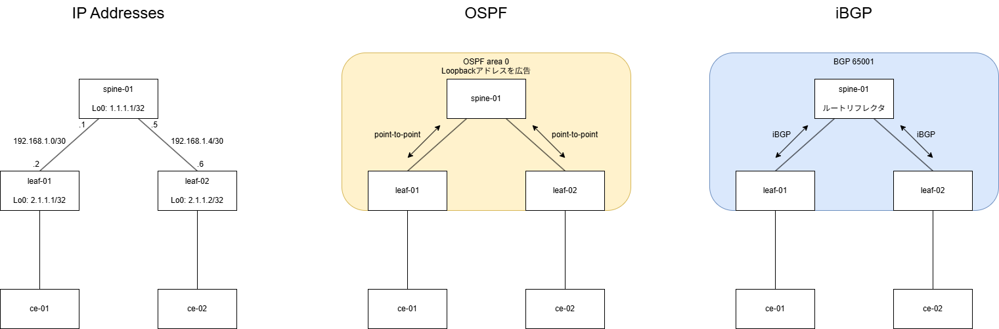
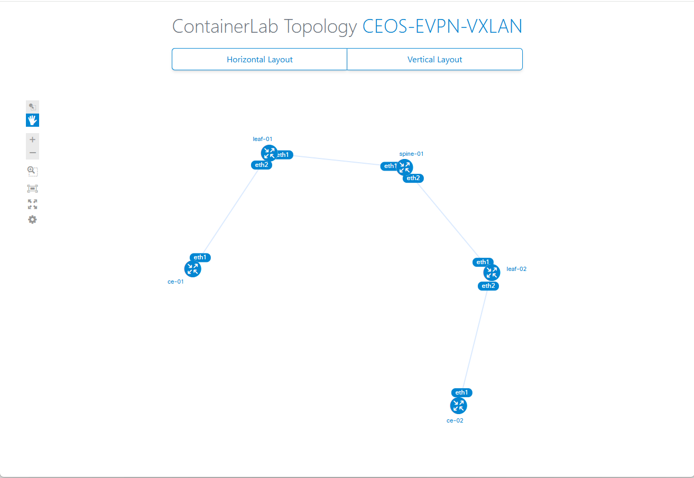

# cEOSでEVPN/VXLANネットワークを作る

[前回]()はcontainerlabを使ってコンテナルータを動かすところまででしたが、今回からいよいよタイトル通りにネットワークを作っていきます。  

Arista cEOSを使って、EVPN/VXLANによるL2VPNを作ります。  
その後、Leafの下にnetshoot(alpine linux)コンテナを2つぶら下げ、同一ネットワークのIPアドレスを設定しL2疎通が可能になることを確認します。

# 構成

[](diagram.drawio.png)
※画像クリックで拡大できます

ネットワーク構成について、トポロジはSpine 1台とLeaf 2台のCLOSネットワークとしました。
アンダーレイにはOSPFを使っています。
EVPN部分となるMP-BGPは、Spine、Leafとも同じASNとなるiBGPで構成しています。この場合、Spineはルートリフレクタとなります。  
ちなみに、設定にあたり参考にしたサイトのConfig例で、SpineにはBGPを設定せずLeaf同士が直接BGPピアを張る設定があったのですが、SpineにBGPを設定しないのは一般的なんですかね？  

動作環境は前回と同じです。  
> - Ubuntu 24.04
> - Docker 28.1.1
> - contaierlab 0.68.0
> - cEOS 4.34.0F

# コンフィグ

最終的にできあがったコンフィグは以下の通りです。

<details>
  <summary>spine-01</summary>

```
! Startup-config last modified at Sat May 17 05:57:25 2025 by root
! device: spine-01 (cEOSLab, EOS-4.34.0F-41641815.4340F (engineering build))
!
no aaa root
!
username admin privilege 15 role network-admin secret sha512 <REMOVED>
!
management api http-commands
   no shutdown
   !
   vrf MGMT
      no shutdown
!
no service interface inactive port-id allocation disabled
!
transceiver qsfp default-mode 4x10G
!
service routing protocols model multi-agent
!
hostname spine-01
!
spanning-tree mode mstp
!
system l1
   unsupported speed action error
   unsupported error-correction action error
!
vrf instance MGMT
!
management api gnmi
   transport grpc default
      vrf MGMT
!
management api netconf
   transport ssh default
      vrf MGMT
!
interface Ethernet1
   no switchport
   ip address 192.168.1.1/30
   ip ospf network point-to-point
   ip ospf area 0.0.0.0
!
interface Ethernet2
   no switchport
   ip address 192.168.1.5/30
   ip ospf network point-to-point
   ip ospf area 0.0.0.0
!
interface Loopback0
   ip address 1.1.1.1/32
   ip ospf area 0.0.0.0
!
interface Management0
   vrf MGMT
   ip address 172.20.20.3/24
   ipv6 address 3fff:172:20:20::3/64
!
ip routing
ip routing vrf MGMT
!
ip route vrf MGMT 0.0.0.0/0 172.20.20.1
!
ipv6 route vrf MGMT ::/0 3fff:172:20:20::1
!
router bgp 65001
   router-id 1.1.1.1
   no bgp default ipv4-unicast
   neighbor PE-RRCLIENTS peer group
   neighbor PE-RRCLIENTS remote-as 65001
   neighbor PE-RRCLIENTS update-source Loopback0
   neighbor PE-RRCLIENTS route-reflector-client
   neighbor PE-RRCLIENTS send-community extended
   neighbor 2.1.1.1 peer group PE-RRCLIENTS
   neighbor 2.1.1.2 peer group PE-RRCLIENTS
   !
   address-family evpn
      neighbor PE-RRCLIENTS activate
!
router multicast
   ipv4
      software-forwarding kernel
   !
   ipv6
      software-forwarding kernel
!
router ospf 1
   router-id 1.1.1.1
   passive-interface Loopback0
   max-lsa 12000
!
end
```

</details>

<details>
  <summary>leaf-01</summary>

```
! Startup-config last modified at Sat May 17 05:57:25 2025 by root
! device: leaf-01 (cEOSLab, EOS-4.34.0F-41641815.4340F (engineering build))
!
no aaa root
!
username admin privilege 15 role network-admin secret sha512 <REMOVED>
!
management api http-commands
   no shutdown
   !
   vrf MGMT
      no shutdown
!
no service interface inactive port-id allocation disabled
!
transceiver qsfp default-mode 4x10G
!
service routing protocols model multi-agent
!
hostname leaf-01
!
spanning-tree mode mstp
!
system l1
   unsupported speed action error
   unsupported error-correction action error
!
vlan 100
!
vrf instance MGMT
!
management api gnmi
   transport grpc default
      vrf MGMT
!
management api netconf
   transport ssh default
      vrf MGMT
!
interface Ethernet1
   no switchport
   ip address 192.168.1.2/30
   ip ospf network point-to-point
   ip ospf area 0.0.0.0
!
interface Ethernet2
   switchport access vlan 100
!
interface Loopback0
   ip address 2.1.1.1/32
   ip ospf area 0.0.0.0
!
interface Management0
   vrf MGMT
   ip address 172.20.20.6/24
   ipv6 address 3fff:172:20:20::6/64
!
interface Vxlan1
   vxlan source-interface Loopback0
   vxlan udp-port 4789
   vxlan vlan 100 vni 10100
!
ip routing
ip routing vrf MGMT
!
ip route vrf MGMT 0.0.0.0/0 172.20.20.1
!
ipv6 route vrf MGMT ::/0 3fff:172:20:20::1
!
router bgp 65001
   router-id 2.1.1.1
   no bgp default ipv4-unicast
   neighbor 1.1.1.1 remote-as 65001
   neighbor 1.1.1.1 update-source Loopback0
   neighbor 1.1.1.1 send-community extended
   !
   vlan 100
      rd 2.1.1.1:100
      route-target both 100:10100
      redistribute learned
   !
   address-family evpn
      neighbor 1.1.1.1 activate
!
router multicast
   ipv4
      software-forwarding kernel
   !
   ipv6
      software-forwarding kernel
!
router ospf 1
   router-id 2.1.1.1
   passive-interface Loopback0
   max-lsa 12000
!
end
```

</details>

<details>
  <summary>leaf-02</summary>

```
! Startup-config last modified at Sat May 17 05:57:25 2025 by root
! device: leaf-02 (cEOSLab, EOS-4.34.0F-41641815.4340F (engineering build))
!
no aaa root
!
username admin privilege 15 role network-admin secret sha512 <REMOVED>
!
management api http-commands
   no shutdown
   !
   vrf MGMT
      no shutdown
!
no service interface inactive port-id allocation disabled
!
transceiver qsfp default-mode 4x10G
!
service routing protocols model multi-agent
!
hostname leaf-02
!
spanning-tree mode mstp
!
system l1
   unsupported speed action error
   unsupported error-correction action error
!
vlan 100
!
vrf instance MGMT
!
management api gnmi
   transport grpc default
      vrf MGMT
!
management api netconf
   transport ssh default
      vrf MGMT
!
interface Ethernet1
   no switchport
   ip address 192.168.1.6/30
   ip ospf network point-to-point
   ip ospf area 0.0.0.0
!
interface Ethernet2
   switchport access vlan 100
!
interface Loopback0
   ip address 2.1.1.2/32
   ip ospf area 0.0.0.0
!
interface Management0
   vrf MGMT
   ip address 172.20.20.4/24
   ipv6 address 3fff:172:20:20::4/64
!
interface Vxlan1
   vxlan source-interface Loopback0
   vxlan udp-port 4789
   vxlan vlan 100 vni 10100
!
ip routing
ip routing vrf MGMT
!
ip route vrf MGMT 0.0.0.0/0 172.20.20.1
!
ipv6 route vrf MGMT ::/0 3fff:172:20:20::1
!
router bgp 65001
   router-id 2.1.1.2
   no bgp default ipv4-unicast
   neighbor 1.1.1.1 remote-as 65001
   neighbor 1.1.1.1 update-source Loopback0
   neighbor 1.1.1.1 send-community extended
   !
   vlan 100
      rd 2.1.1.2:100
      route-target both 100:10100
      redistribute learned
   !
   address-family evpn
      neighbor 1.1.1.1 activate
!
router multicast
   ipv4
      software-forwarding kernel
   !
   ipv6
      software-forwarding kernel
!
router ospf 1
   router-id 2.1.1.2
   passive-interface Loopback0
   max-lsa 12000
!
end
```

</details>

# 構築

## containerlab

まず、containerlabのトポロジファイルを作ってデプロイします。
cEOSを3台、netshootを2台定義します。

cEOSの構成では、管理IFとなるeth0とそれ以外のIFとでネットワークを分けたかったので、環境変数`CLAB_MGMT_VRF`でVRF名を指定することでネットワークの分離を実現しています。
これを設定すると、cEOSがデプロイされた時点でeth0にそのVRFが割り当てられます。

最終的にできたものが以下。
```yaml
name: ceos-evpn-vxlan
topology:
  kinds:
    arista_ceos:
      image: ceos:4.34.0F
      env:
        CLAB_MGMT_VRF: MGMT
    linux:
      image: nicolaka/netshoot:latest

  nodes:
    spine-01:
      kind: arista_ceos
    leaf-01:
      kind: arista_ceos
    leaf-02:
      kind: arista_ceos
    ce-01:
      kind: linux
    ce-02:
      kind: linux

  links:
    - endpoints: [spine-01:eth1, leaf-01:eth1]
    - endpoints: [spine-01:eth2, leaf-02:eth1]
    - endpoints: [leaf-01:eth2, ce-01:eth1]
    - endpoints: [leaf-02:eth2, ce-02:eth1]

```

あとは`clab deploy`コマンドを実行してデプロイします。  
そういえば知らなかったんですが、トポロジファイルはファイル名のサフィックスを`.clab.yml`もしくは`.clab.yaml`にすると、`clab deploy`コマンドで`-t`オプションでトポロジファイルを指定しなくても、カレントディレクトリからそれらのファイルを探索して自動的に読み込んでくれます。

デプロイ後、`clab graph`で生成した図は以下のようになりました。構成と一致しています。
[](clab-topo.png)

## アンダーレイの設定

IPアドレスとOSPFを設定していきます。  
OSPFの目的は、各ルータのループバックアドレスの広告です。
オーバーレイのコントロールプレーンとなるEVPN（MP-BGP）は、ループバックアドレスを使ってピアを張るためです。

- spine-01

```
interface Ethernet1
   no switchport
   ip address 192.168.1.1/30
   ip ospf network point-to-point
   ip ospf area 0.0.0.0
!
interface Ethernet2
   no switchport
   ip address 192.168.1.5/30
   ip ospf network point-to-point
   ip ospf area 0.0.0.0
!
interface Loopback0
   ip address 1.1.1.1/32
   ip ospf area 0.0.0.0
!   
ip routing
!
router ospf 1
   router-id 1.1.1.1
   passive-interface Loopback0
   max-lsa 12000
!
```

- leaf-01

```
interface Ethernet1
   no switchport
   ip address 192.168.1.2/30
   ip ospf network point-to-point
   ip ospf area 0.0.0.0
!
interface Loopback0
   ip address 2.1.1.1/32
   ip ospf area 0.0.0.0
!
ip routing
!
router ospf 1
   router-id 2.1.1.1
   passive-interface Loopback0
   max-lsa 12000
!
```

- leaf-02

```
interface Ethernet1
   no switchport
   ip address 192.168.1.6/30
   ip ospf network point-to-point
   ip ospf area 0.0.0.0
!
interface Loopback0
   ip address 2.1.1.2/32
   ip ospf area 0.0.0.0
!
ip routing
!
router ospf 1
   router-id 2.1.1.2
   passive-interface Loopback0
   max-lsa 12000
!
```

---

設定後、`show ip ospf neighbor`, `show ip route`を見ると、無事にネイバの確立と経路が交換できていることが分かります。  
※spine-01だけ載せます。leafも同様の表記になります。

```
spine-01#show ip ospf neighbor 
Neighbor ID     Instance VRF      Pri State                  Dead Time   Address         Interface
2.1.1.1         1        default  0   FULL                   00:00:33    192.168.1.2     Ethernet1
2.1.1.2         1        default  0   FULL                   00:00:30    192.168.1.6     Ethernet2
spine-01#
spine-01#show ip route

VRF: default
Source Codes:
       C - connected, S - static, K - kernel,
       O - OSPF, O IA - OSPF inter area, O E1 - OSPF external type 1,
       O E2 - OSPF external type 2, O N1 - OSPF NSSA external type 1,
       O N2 - OSPF NSSA external type2, O3 - OSPFv3,
       O3 IA - OSPFv3 inter area, O3 E1 - OSPFv3 external type 1,
       O3 E2 - OSPFv3 external type 2,
       O3 N1 - OSPFv3 NSSA external type 1,
       O3 N2 - OSPFv3 NSSA external type2, B - Other BGP Routes,
       B I - iBGP, B E - eBGP, R - RIP, I L1 - IS-IS level 1,
       I L2 - IS-IS level 2, A B - BGP Aggregate,
       A O - OSPF Summary, NG - Nexthop Group Static Route,
       V - VXLAN Control Service, M - Martian,
       DH - DHCP client installed default route,
       DP - Dynamic Policy Route, L - VRF Leaked,
       G  - gRIBI, RC - Route Cache Route,
       CL - CBF Leaked Route

Gateway of last resort is not set

 C        1.1.1.1/32
           directly connected, Loopback0
 O        2.1.1.1/32 [110/20]
           via 192.168.1.2, Ethernet1
 O        2.1.1.2/32 [110/20]
           via 192.168.1.6, Ethernet2
 C        192.168.1.0/30
           directly connected, Ethernet1
 C        192.168.1.4/30
           directly connected, Ethernet2

spine-01#
```

## VXLANの設定

オーバーレイのデータプレーンであるVXLANの設定を入れます。
VXLANの設定はVTEPとなるleafにだけ入れ、spineには必要ありません。  
このタイミングでついでに、CE向かいのアクセスポートの設定も入れておきます。  
今回はどちらのleafもVlan 100とVNI 10100を紐づけます。

- leaf-01

```
vlan 100
!
interface Ethernet2
   switchport access vlan 100
!
interface Vxlan1
   vxlan source-interface Loopback0
   vxlan udp-port 4789
   vxlan vlan 100 vni 10100
!
```

- leaf-02

```
vlan 100
!
interface Ethernet2
   switchport access vlan 100
!
interface Vxlan1
   vxlan source-interface Loopback0
   vxlan udp-port 4789
   vxlan vlan 100 vni 10100
!
```

実質同じ設定が入ります。

## EVPNの設定

MP-BGPを追加して、EVPNを設定していきます。

- spine-01  
spine-01では、ルートリフレクタ クライアント向けのピアの設定をpeer groupでグルーピングし、leaf-01, leaf-02に適用しています。
```
service routing protocols model multi-agent
!
router bgp 65001
   router-id 1.1.1.1
   no bgp default ipv4-unicast
   neighbor PE-RRCLIENTS peer group
   neighbor PE-RRCLIENTS remote-as 65001
   neighbor PE-RRCLIENTS update-source Loopback0
   neighbor PE-RRCLIENTS route-reflector-client
   neighbor PE-RRCLIENTS send-community extended
   neighbor 2.1.1.1 peer group PE-RRCLIENTS
   neighbor 2.1.1.2 peer group PE-RRCLIENTS
   !
   address-family evpn
      neighbor PE-RRCLIENTS activate
!
```

- leaf-01  
leaf-01, leaf-02はそれぞれ、spineへiBGPピアを張ることになります。
```
service routing protocols model multi-agent
!
router bgp 65001
   router-id 2.1.1.1
   no bgp default ipv4-unicast
   neighbor 1.1.1.1 remote-as 65001
   neighbor 1.1.1.1 update-source Loopback0
   neighbor 1.1.1.1 send-community extended
   !
   vlan 100
      rd 2.1.1.1:100
      route-target both 100:10100
      redistribute learned
   !
   address-family evpn
      neighbor 1.1.1.1 activate
!
```

- leaf-02

```
service routing protocols model multi-agent
!
router bgp 65001
   router-id 2.1.1.2
   no bgp default ipv4-unicast
   neighbor 1.1.1.1 remote-as 65001
   neighbor 1.1.1.1 update-source Loopback0
   neighbor 1.1.1.1 send-community extended
   !
   vlan 100
      rd 2.1.1.2:100
      route-target both 100:10100
      redistribute learned
   !
   address-family evpn
      neighbor 1.1.1.1 activate
!
```

---

leaf-01の設定後の状態を確認してみます。

- `show bgp evpn summary`

```
leaf-01#show bgp evpn summary
BGP summary information for VRF default
Router identifier 2.1.1.1, local AS number 65001
Neighbor Status Codes: m - Under maintenance
Neighbor V AS           MsgRcvd   MsgSent  InQ OutQ  Up/Down State   PfxRcd PfxAcc
1.1.1.1  4 65001            319       319    0    0 04:26:22 Estab   1      1
leaf-01#
```

StateがEstab(Established)になっており、BGPピアが確立しています。

- `show interfaces vxlan 1`

```
leaf-01#show interfaces vxlan 1
Vxlan1 is up, line protocol is up (connected)
  Hardware is Vxlan
  Source interface is Loopback0 and is active with 2.1.1.1
  Listening on UDP port 4789
  Replication/Flood Mode is headend with Flood List Source: EVPN
  Remote MAC learning via EVPN
  VNI mapping to VLANs
  Static VLAN to VNI mapping is 
    [100, 10100]     
  Note: All Dynamic VLANs used by VCS are internal VLANs.
        Use 'show vxlan vni' for details.
  Static VRF to VNI mapping is not configured
  Headend replication flood vtep list is:
   100 2.1.1.2        
  Shared Router MAC is 0000.0000.0000
leaf-01#
```

Vxlan1インターフェースがupしています。VLAN to VNIマッピングも設定通りです。  
また、Headend replication flood vtep list に `100 2.1.1.2` と記載されていることから、leaf-02をVXLAN VTEPと認識していることが分かります。無事にEVPNによってVTEPの情報が広告されました。

## 動作確認

EVPN/VXLANによるオーバーレイネットワークが構築できたようなので、CEから疎通確認をしてみます。

まず、ce-01, ce-02のeth1インターフェースにIPアドレスを割り当てます。

- ce-01

```
~ # ip address add 10.1.1.1/24 dev eth1
```

- ce-02

```
~ # ip address add 10.1.1.2/24 dev eth1
```

割り当てが完了したら、ce-01からce-02に向けてPingを打ちます。

```
~ # ping 10.1.1.2
PING 10.1.1.2 (10.1.1.2) 56(84) bytes of data.
64 bytes from 10.1.1.2: icmp_seq=1 ttl=64 time=3.06 ms
64 bytes from 10.1.1.2: icmp_seq=2 ttl=64 time=1.95 ms
64 bytes from 10.1.1.2: icmp_seq=3 ttl=64 time=1.87 ms
64 bytes from 10.1.1.2: icmp_seq=4 ttl=64 time=1.86 ms
64 bytes from 10.1.1.2: icmp_seq=5 ttl=64 time=1.97 ms
^C
--- 10.1.1.2 ping statistics ---
5 packets transmitted, 5 received, 0% packet loss, time 4007ms
rtt min/avg/max/mdev = 1.859/2.141/3.055/0.459 ms
~ # 
```

無事に疎通ができました。

---

Pingをした後、leaf-01の状態を確認してみます。  
ceからフレームが飛んできたので、EVPN経由でMACアドレスを学習している様子が見れます。

- `show mac address-table`

```
leaf-01#show mac address-table 
          Mac Address Table
------------------------------------------------------------------

Vlan    Mac Address       Type        Ports      Moves   Last Move
----    -----------       ----        -----      -----   ---------
 100    aac1.ab48.1fdf    DYNAMIC     Et2        1       0:05:04 ago
 100    aac1.ab6d.1624    DYNAMIC     Vx1        1       0:05:04 ago
Total Mac Addresses for this criterion: 2

          Multicast Mac Address Table
------------------------------------------------------------------

Vlan    Mac Address       Type        Ports
----    -----------       ----        -----
Total Mac Addresses for this criterion: 0
leaf-01#
```

1番目のエントリはce-01のMACアドレス、2番目のエントリはce-02のMACアドレスです。
ce-02のMACアドレスはPortsがVx1となっており、Vxlan1インターフェースなのが分かります。

- `show vxlan address-table`

```
leaf-01#show vxlan address-table 
          Vxlan Mac Address Table
----------------------------------------------------------------------

VLAN  Mac Address     Type      Prt  VTEP             Moves   Last Move
----  -----------     ----      ---  ----             -----   ---------
 100  aac1.ab6d.1624  EVPN      Vx1  2.1.1.2          1       0:05:12 ago
Total Remote Mac Addresses for this criterion: 1
leaf-01#
```

TypeにEVPNと書いてあるように、EVPNからMACアドレスを広告してもらったことが分かります。

- `show bgp evpn`

```
leaf-01#show bgp evpn 
BGP routing table information for VRF default
Router identifier 2.1.1.1, local AS number 65001
Route status codes: * - valid, > - active, S - Stale, E - ECMP head, e - ECMP
                    c - Contributing to ECMP, % - Pending best path selection
Origin codes: i - IGP, e - EGP, ? - incomplete
AS Path Attributes: Or-ID - Originator ID, C-LST - Cluster List, LL Nexthop - Link Local Nexthop

          Network                Next Hop              Metric  LocPref Weight  Path
 * >      RD: 2.1.1.1:100 mac-ip aac1.ab48.1fdf
                                 -                     -       -       0       i
 * >      RD: 2.1.1.2:100 mac-ip aac1.ab6d.1624
                                 2.1.1.2               -       100     0       i Or-ID: 2.1.1.2 C-LST: 1.1.1.1 
 * >      RD: 2.1.1.1:100 imet 2.1.1.1
                                 -                     -       -       0       i
 * >      RD: 2.1.1.2:100 imet 2.1.1.2
                                 2.1.1.2               -       100     0       i Or-ID: 2.1.1.2 C-LST: 1.1.1.1 
leaf-01#
```

EVPNで広告されているので、BGPテーブルにMACアドレスが載っています。

# おわりに

今回はcEOS、EVPN/VXLAN、iBGPという構成でL2VPNを構成してみました。  
取り合えずL2で疎通が取れるところまでの最低限の設定というところですが、実際のDCネットワークに適用する場合は、冗長性や効率性、スケール、QoSなどを考えてもっと複雑な設定になると思います。

このEVPNを作るシリーズはもう少しだけ続けていくつもりです。  
次回はこんなこともしたいなーと考えています。

- EVPN/MPLS L2VPNを作る
- BGP Unnumberedでピアを張る
- Spine, Leafで異なるASNを使い、eBGPでEVPNを構成する
- パケットキャプチャもしてみる
- Juniper cRPDで作ってみる

記事で作ったcontainerlabのトポロジファイルやルータのコンフィグは、後日GitHubで公開しようと思います。

# 参考URL

- [AristaEOSでEVPN/VXLAN設定をContanerLab上で構成する](https://gorosuke5656.hatenablog.com/entry/2024/11/23/213047)
- [Arista EOS Layer2 EVPNの設定紹介 – 自宅で体験できるファブリックネットワーク](https://changineer.info/network/arista_eos/arista_eos_evpn_layer2.html)
- [Prepare to Offer VPN Services to Customers via MP-BGP EVPN Control-Plane](https://labguides.testdrive.arista.com/2024.1/advanced_routing/mesh/isis_sr_evpn/lab_guide/lg_mesh_prepare/)
