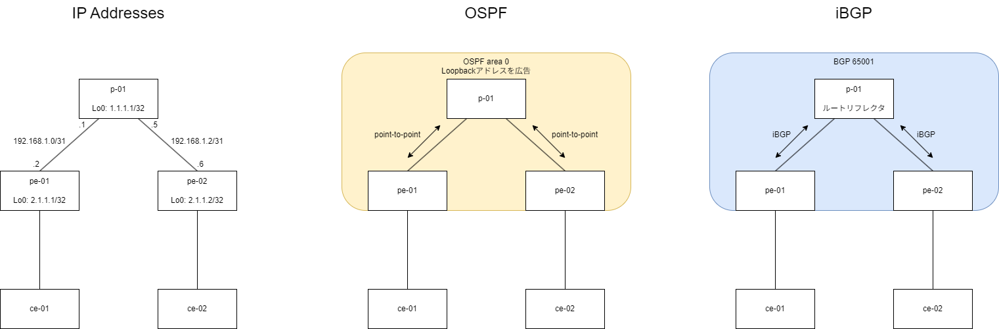
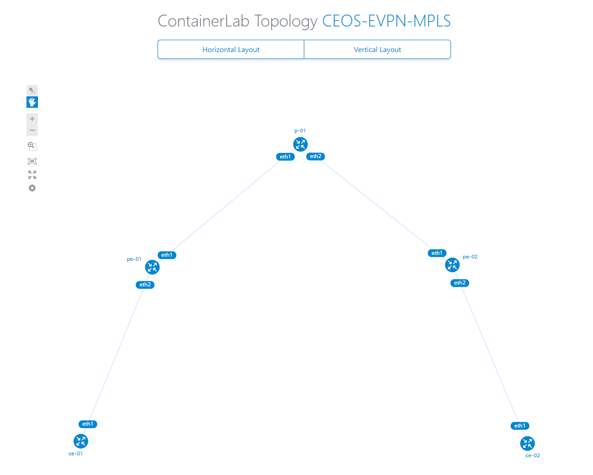
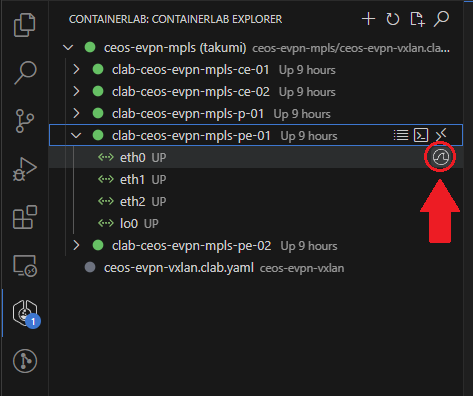
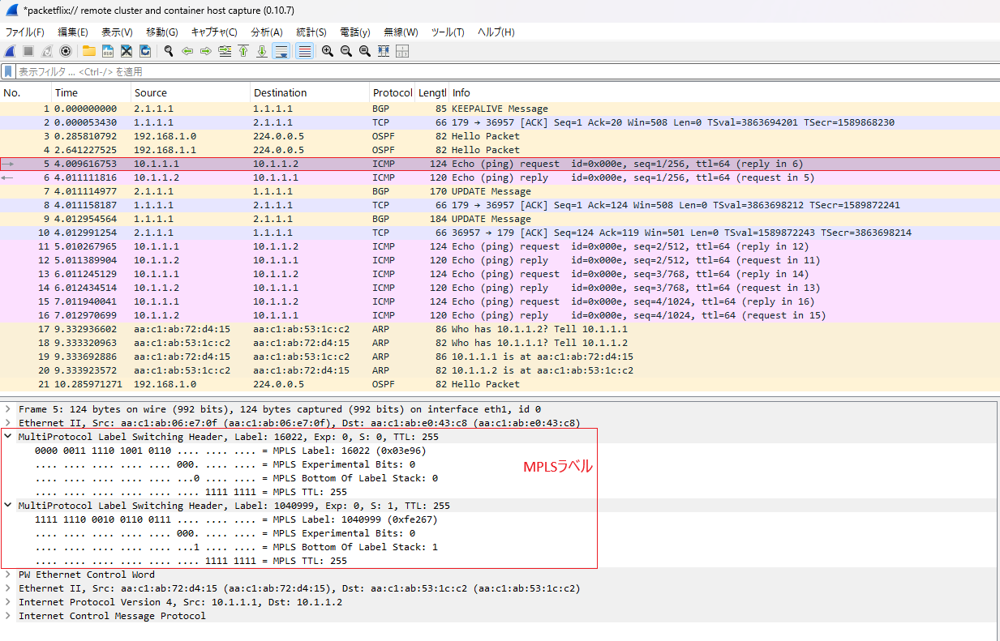

# cEOSでEVPN/MPLSネットワークを作る

今回はEVPN/MPLSのL2VPNを作ります。  
[EVPN/VXLAN]()の時と同じように、netshootコンテナでPingを行い、L2リーチャビリティを確認します。  

Arista EOSでのEVPN/MPLSの設定については既に[この方](https://qiita.com/k-maki/items/b3cb86cdf11e6437ffc6)が詳しい情報を載せており、このページの作成に当たって大いに参考にさせていただきました。

# 構成

[](diagram.drawio.png)
※画像クリックで拡大できます

トポロジやアンダーレイのプロトコルスタックはVXLANの時と変わりません。ホスト名はSpine, LeafからP, PEに変えています。  
また、PルータとPEルータ間のネットワークを/31にしました。

# コンフィグ

最終的にできあがったコンフィグは以下の通りです。

<details>
  <summary>p-01</summary>

```
! Startup-config last modified at Sat May 31 08:29:56 2025 by root
! device: p-01 (cEOSLab, EOS-4.34.0F-41641815.4340F (engineering build))
!
no aaa root
!
username admin privilege 15 role network-admin secret sha512 <REMOVED>
!
management api http-commands
   no shutdown
   !
   vrf MGMT
      no shutdown
!
no service interface inactive port-id allocation disabled
!
transceiver qsfp default-mode 4x10G
!
service routing protocols model multi-agent
!
hostname p-01
!
spanning-tree mode mstp
!
system l1
   unsupported speed action error
   unsupported error-correction action error
!
vrf instance MGMT
!
management api gnmi
   transport grpc default
      vrf MGMT
!
management api netconf
   transport ssh default
      vrf MGMT
!
interface Ethernet1
   no switchport
   ip address 192.168.1.1/31
   ip ospf network point-to-point
   ip ospf area 0.0.0.0
!
interface Ethernet2
   no switchport
   ip address 192.168.1.3/31
   ip ospf network point-to-point
   ip ospf area 0.0.0.0
!
interface Loopback0
   ip address 1.1.1.1/32
   ip ospf area 0.0.0.0
!
interface Management0
   vrf MGMT
   ip address 172.20.20.3/24
   ipv6 address 3fff:172:20:20::3/64
!
ip routing
no ip routing vrf MGMT
!
ip route vrf MGMT 0.0.0.0/0 172.20.20.1
!
ipv6 route vrf MGMT ::/0 3fff:172:20:20::1
!
mpls ip
!
mpls label range ospf-sr 16000 8000
mpls label range static 16 15984
!
router bgp 65001
   router-id 1.1.1.1
   no bgp default ipv4-unicast
   neighbor PE-RRCLIENTS peer group
   neighbor PE-RRCLIENTS remote-as 65001
   neighbor PE-RRCLIENTS update-source Loopback0
   neighbor PE-RRCLIENTS route-reflector-client
   neighbor PE-RRCLIENTS send-community extended
   neighbor 2.1.1.1 peer group PE-RRCLIENTS
   neighbor 2.1.1.2 peer group PE-RRCLIENTS
   !
   address-family evpn
      neighbor PE-RRCLIENTS activate
      neighbor PE-RRCLIENTS encapsulation mpls 
!
router multicast
   ipv4
      software-forwarding kernel
   !
   ipv6
      software-forwarding kernel
!
router ospf 1
   router-id 1.1.1.1
   passive-interface Loopback0
   max-lsa 12000
   !
   segment-routing mpls
      no shutdown
      prefix-segment 1.1.1.1/32 index 11
!
end
```

</details>

<details>
  <summary>pe-01</summary>

```
! Startup-config last modified at Sat May 31 08:29:56 2025 by root
! device: pe-01 (cEOSLab, EOS-4.34.0F-41641815.4340F (engineering build))
!
no aaa root
!
username admin privilege 15 role network-admin secret sha512 <REMOVED>
!
management api http-commands
   no shutdown
   !
   vrf MGMT
      no shutdown
!
no service interface inactive port-id allocation disabled
!
transceiver qsfp default-mode 4x10G
!
service routing protocols model multi-agent
!
hostname pe-01
!
spanning-tree mode mstp
!
system l1
   unsupported speed action error
   unsupported error-correction action error
!
vlan 100
!
vrf instance MGMT
!
management api gnmi
   transport grpc default
      vrf MGMT
!
management api netconf
   transport ssh default
      vrf MGMT
!
interface Ethernet1
   no switchport
   ip address 192.168.1.0/31
   ip ospf network point-to-point
   ip ospf area 0.0.0.0
!
interface Ethernet2
   switchport access vlan 100
!
interface Loopback0
   ip address 2.1.1.1/32
   ip ospf area 0.0.0.0
!
interface Management0
   vrf MGMT
   ip address 172.20.20.2/24
   ipv6 address 3fff:172:20:20::2/64
!
ip routing
no ip routing vrf MGMT
!
ip route vrf MGMT 0.0.0.0/0 172.20.20.1
!
ipv6 route vrf MGMT ::/0 3fff:172:20:20::1
!
mpls ip
!
mpls label range ospf-sr 16000 8000
mpls label range static 16 15984
!
router bgp 65001
   router-id 2.1.1.1
   no bgp default ipv4-unicast
   neighbor 1.1.1.1 remote-as 65001
   neighbor 1.1.1.1 update-source Loopback0
   neighbor 1.1.1.1 send-community extended
   !
   vlan 100
      rd 2.1.1.1:100
      route-target both 65000:100
      redistribute learned
   !
   address-family evpn
      neighbor 1.1.1.1 activate
      neighbor 1.1.1.1 encapsulation mpls next-hop-self source-interface Loopback0
!
router multicast
   ipv4
      software-forwarding kernel
   !
   ipv6
      software-forwarding kernel
!
router ospf 1
   router-id 2.1.1.1
   passive-interface Loopback0
   max-lsa 12000
   !
   segment-routing mpls
      no shutdown
      prefix-segment 2.1.1.1/32 index 21
!
end
```

</details>

<details>
  <summary>pe-02</summary>

```
! Startup-config last modified at Sat May 31 08:29:56 2025 by root
! device: pe-02 (cEOSLab, EOS-4.34.0F-41641815.4340F (engineering build))
!
no aaa root
!
username admin privilege 15 role network-admin secret sha512 <REMOVED>
!
management api http-commands
   no shutdown
   !
   vrf MGMT
      no shutdown
!
no service interface inactive port-id allocation disabled
!
transceiver qsfp default-mode 4x10G
!
service routing protocols model multi-agent
!
hostname pe-02
!
spanning-tree mode mstp
!
system l1
   unsupported speed action error
   unsupported error-correction action error
!
vlan 100
!
vrf instance MGMT
!
management api gnmi
   transport grpc default
      vrf MGMT
!
management api netconf
   transport ssh default
      vrf MGMT
!
interface Ethernet1
   no switchport
   ip address 192.168.1.2/31
   ip ospf network point-to-point
   ip ospf area 0.0.0.0
!
interface Ethernet2
   switchport access vlan 100
!
interface Loopback0
   ip address 2.1.1.2/32
   ip ospf area 0.0.0.0
!
interface Management0
   vrf MGMT
   ip address 172.20.20.4/24
   ipv6 address 3fff:172:20:20::4/64
!
ip routing
no ip routing vrf MGMT
!
ip route vrf MGMT 0.0.0.0/0 172.20.20.1
!
ipv6 route vrf MGMT ::/0 3fff:172:20:20::1
!
mpls ip
!
mpls label range ospf-sr 16000 8000
mpls label range static 16 15984
!
router bgp 65001
   router-id 2.1.1.2
   no bgp default ipv4-unicast
   neighbor 1.1.1.1 remote-as 65001
   neighbor 1.1.1.1 update-source Loopback0
   neighbor 1.1.1.1 send-community extended
   !
   vlan 100
      rd 2.1.1.2:100
      route-target both 65000:100
      redistribute learned
   !
   address-family evpn
      neighbor 1.1.1.1 activate
      neighbor 1.1.1.1 encapsulation mpls next-hop-self source-interface Loopback0
!
router multicast
   ipv4
      software-forwarding kernel
   !
   ipv6
      software-forwarding kernel
!
router ospf 1
   router-id 2.1.1.2
   passive-interface Loopback0
   max-lsa 12000
   !
   segment-routing mpls
      no shutdown
      prefix-segment 2.1.1.2/32 index 22
!
end
```

</details>

# 構築

## containerlab

名前が変わった以外は、VXLANの時と同様です。

```
name: ceos-evpn-mpls
topology:
  kinds:
    arista_ceos:
      image: ceos:4.34.0F
      env:
        CLAB_MGMT_VRF: MGMT
    linux:
      image: nicolaka/netshoot:latest

  nodes:
    p-01:
      kind: arista_ceos
    pe-01:
      kind: arista_ceos
    pe-02:
      kind: arista_ceos
    ce-01:
      kind: linux
    ce-02:
      kind: linux

  links:
    - endpoints: [p-01:eth1, pe-01:eth1]
    - endpoints: [p-01:eth2, pe-02:eth1]
    - endpoints: [pe-01:eth2, ce-01:eth1]
    - endpoints: [pe-02:eth2, ce-02:eth1]
```

`clab graph`で生成した図は以下のとおりです。一緒ですね。

[](clab-topo_evpn-mpls.png)

---

## アンダーレイの設定

IPアドレス、OSPFの設定を入れていきます。ここは完全にVXLANの時と一緒です。

<details>
  <summary>p-01</summary>

```
interface Ethernet1
   no switchport
   ip address 192.168.1.1/31
   ip ospf network point-to-point
   ip ospf area 0.0.0.0
!
interface Ethernet2
   no switchport
   ip address 192.168.1.3/31
   ip ospf network point-to-point
   ip ospf area 0.0.0.0
!
interface Loopback0
   ip address 1.1.1.1/32
   ip ospf area 0.0.0.0
!   
ip routing
!
router ospf 1
   router-id 1.1.1.1
   passive-interface Loopback0
   max-lsa 12000
!
```

</details>

<details>
  <summary>pe-01</summary>

```
interface Ethernet1
   no switchport
   ip address 192.168.1.0/31
   ip ospf network point-to-point
   ip ospf area 0.0.0.0
!
interface Loopback0
   ip address 2.1.1.1/32
   ip ospf area 0.0.0.0
!
ip routing
!
router ospf 1
   router-id 2.1.1.1
   passive-interface Loopback0
   max-lsa 12000
!
```

</details>

<details>
  <summary>pe-02</summary>

```
interface Ethernet1
   no switchport
   ip address 192.168.1.2/31
   ip ospf network point-to-point
   ip ospf area 0.0.0.0
!
interface Loopback0
   ip address 2.1.1.2/32
   ip ospf area 0.0.0.0
!
ip routing
!
router ospf 1
   router-id 2.1.1.2
   passive-interface Loopback0
   max-lsa 12000
!
```

</details>

---

## SR-MPLSの設定

Segment Routing, MPLSの設定を入れます。  
Segment Routingは、OSPFの設定の中で有効にできます。

<details>
  <summary>p-01</summary>

```
mpls ip
!
mpls label range ospf-sr 16000 8000
mpls label range static 16 15984
!
router ospf 1
   segment-routing mpls
      no shutdown
      prefix-segment 1.1.1.1/32 index 11
!
```

</details>

<details>
  <summary>pe-01</summary>

```
mpls ip
!
mpls label range ospf-sr 16000 8000
mpls label range static 16 15984
!
router ospf 1
   segment-routing mpls
      no shutdown
      prefix-segment 2.1.1.1/32 index 21
!
```

</details>

<details>
  <summary>pe-02</summary>

```
mpls ip
!
mpls label range ospf-sr 16000 8000
mpls label range static 16 15984
!
router ospf 1
   segment-routing mpls
      no shutdown
      prefix-segment 2.1.1.2/32 index 22
!
```

</details>

Node SIDの値が異なる以外は同じ設定が入ります。

---

## EVPNの設定

今回もルートリフレクタを利用したiBGP構成としているため、Pルータがルートリフレクタを兼任するようにしています。  
設定でVXLANの場合と異なるのは、`address-family evpn`の中で`encapsulation mpls`を指定している部分です。
EOSではデフォルトだとencapがVXLANとなっているようで、特に何も設定しない場合はVXLANになります。

PEルータは、ついでにVPNの設定も入れてます。

<details>
  <summary>p-01</summary>

```
service routing protocols model multi-agent
!
router bgp 65001
   router-id 1.1.1.1
   no bgp default ipv4-unicast
   neighbor PE-RRCLIENTS peer group
   neighbor PE-RRCLIENTS remote-as 65001
   neighbor PE-RRCLIENTS update-source Loopback0
   neighbor PE-RRCLIENTS route-reflector-client
   neighbor PE-RRCLIENTS send-community extended
   neighbor 2.1.1.1 peer group PE-RRCLIENTS
   neighbor 2.1.1.2 peer group PE-RRCLIENTS
   !
   address-family evpn
      neighbor PE-RRCLIENTS activate
      neighbor PE-RRCLIENTS encapsulation mpls
!
```

</details>

<details>
  <summary>pe-01</summary>

```
service routing protocols model multi-agent
!
vlan 100
!
interface Ethernet2
   switchport access vlan 100
!
router bgp 65001
   router-id 2.1.1.1
   no bgp default ipv4-unicast
   neighbor 1.1.1.1 remote-as 65001
   neighbor 1.1.1.1 update-source Loopback0
   neighbor 1.1.1.1 send-community extended
   !
   vlan 100
      rd 2.1.1.1:100
      route-target both 65001:100
      redistribute learned
   !
   address-family evpn
      neighbor 1.1.1.1 activate
      neighbor 1.1.1.1 encapsulation mpls next-hop-self source-interface Loopback0
!
```

</details>

<details>
  <summary>pe-02</summary>

```
service routing protocols model multi-agent
!
vlan 100
!
interface Ethernet2
   switchport access vlan 100
!
router bgp 65001
   router-id 2.1.1.2
   no bgp default ipv4-unicast
   neighbor 1.1.1.1 remote-as 65001
   neighbor 1.1.1.1 update-source Loopback0
   neighbor 1.1.1.1 send-community extended
   !
   vlan 100
      rd 2.1.1.2:100
      route-target both 65001:100
      redistribute learned
   !
   address-family evpn
      neighbor 1.1.1.1 activate
      neighbor 1.1.1.1 encapsulation mpls next-hop-self source-interface Loopback0
!
```

</details>

---

## 動作確認

まず、各プロトコルの状態をさらっと確認します。  
PEルータにコマンドを実行していきます。

**・OSPF**  
`show ip ospf neighbor`  
`show ip route`

```
pe-01#show ip ospf neighbor 
Neighbor ID     Instance VRF      Pri State                  Dead Time   Address         Interface
1.1.1.1         1        default  0   FULL                   00:00:32    192.168.1.1     Ethernet1
pe-01#
pe-01#show ip route

VRF: default
Source Codes:
       C - connected, S - static, K - kernel,
       O - OSPF, O IA - OSPF inter area, O E1 - OSPF external type 1,
       O E2 - OSPF external type 2, O N1 - OSPF NSSA external type 1,
       O N2 - OSPF NSSA external type2, O3 - OSPFv3,
       O3 IA - OSPFv3 inter area, O3 E1 - OSPFv3 external type 1,
       O3 E2 - OSPFv3 external type 2,
       O3 N1 - OSPFv3 NSSA external type 1,
       O3 N2 - OSPFv3 NSSA external type2, B - Other BGP Routes,
       B I - iBGP, B E - eBGP, R - RIP, I L1 - IS-IS level 1,
       I L2 - IS-IS level 2, A B - BGP Aggregate,
       A O - OSPF Summary, NG - Nexthop Group Static Route,
       V - VXLAN Control Service, M - Martian,
       DH - DHCP client installed default route,
       DP - Dynamic Policy Route, L - VRF Leaked,
       G  - gRIBI, RC - Route Cache Route,
       CL - CBF Leaked Route

Gateway of last resort is not set

 O        1.1.1.1/32 [110/20]
           via 192.168.1.1, Ethernet1
 C        2.1.1.1/32
           directly connected, Loopback0
 O        2.1.1.2/32 [110/30]
           via 192.168.1.1, Ethernet1
 C        192.168.1.0/31
           directly connected, Ethernet1
 O        192.168.1.2/31 [110/20]
           via 192.168.1.1, Ethernet1

pe-01#
```

対向とネイバ確立、ルート情報の交換ができています。

**・Segment Routing**  
`show ip ospf segment-routing adjacency-segments`  
`show ip ospf segment-routing bindings`

```
pe-01#show ip ospf segment-routing adjacency-segments 
OSPF Instance ID: 1
SR supported Data-plane: MPLS                   SR Router ID: 2.1.1.1
Adj-SID allocation mode: SR-adjacencies
Adj-SID allocation pool: Base: 100000     Size: 16384
Adjacency Segment Count: 1
Flag Descriptions: B: Backup, V: Value, L: Local,
                   G: Group, P: Persistent

Segment Status codes: P2P - Point-to-Point adjacency, LAN - Broadcast adjacency

   Adj IP Address       Local Intf          SID       SID Source                     Flags       Type     Protection
-------------------- ---------------- ------------ ---------------- ------------------------- ---------- -----------
      192.168.1.1              Et1       100000          Dynamic       B:0 V:1 L:1 G:0 P:0        P2P    unprotected

pe-01#
pe-01#show ip ospf segment-routing bindings 
1.1.1.1/32
   Local binding:  Label: 16011
   Remote binding: Peer ID: 1.1.1.1, Label: imp-null
2.1.1.1/32
   Local binding:  Label: imp-null
   Remote binding: Peer ID: 1.1.1.1, Label: 16021
2.1.1.2/32
   Local binding:  Label: 16022
   Remote binding: Peer ID: 1.1.1.1, Label: 16022
pe-01#
```

Adjacency Segmentが表示されています。
また、MPLSラベルとのバインディングもできています。

**・MPLS**  
`show mpls route`

```
pe-01#show mpls route
MPLS forwarding table (Label [metric] Vias) - 5 routes 
MPLS next-hop resolution allow default route: False
Metric Codes:
          A - Active metric
Via Type Codes:
          M - MPLS via, LP - LDP pseudowire via,
          I - IP lookup via, V - VLAN via,
          VA - EVPN VLAN aware via, ES - EVPN ethernet segment via,
          VF - EVPN VLAN flood via, AF - EVPN VLAN aware flood via,
          NG - Nexthop group via, BP - BGP pseudowire via,
          VP - VPWS pseudowire via, MSP - Static pseudowire via

 16011   A[1]
                via M, 192.168.1.1, pop
                    EgressACL: apply
                    directly connected, Ethernet1
                    aa:c1:ab:e0:43:c8, vlan 1006
 16022   A[1]
                via M, 192.168.1.1, swap 16022
                    EgressACL: apply
                    directly connected, Ethernet1
                    aa:c1:ab:e0:43:c8, vlan 1006
 100000  A[1]
                via M, 192.168.1.1, pop
                    EgressACL: apply
                    directly connected, Ethernet1
                    aa:c1:ab:e0:43:c8, vlan 1006
 1040999  [0]
                via VF, vlan100, control word present
 1047390  [0]
                via V, vlan100, control word present
pe-01#
```

MPLSフォワーディングテーブルにいくつかのエントリが表示されています。VLAN100もエントリに入っています。

**・BGP**  
`show bgp evpn summary`  
`show bgp evpn`

```
pe-01#show bgp evpn summary 
BGP summary information for VRF default
Router identifier 2.1.1.1, local AS number 65001
Neighbor Status Codes: m - Under maintenance
  Neighbor V AS           MsgRcvd   MsgSent  InQ OutQ  Up/Down State   PfxRcd PfxAcc
  1.1.1.1  4 65001            442       443    0    0 05:30:26 Estab   1      1
pe-01#
pe-01#show bgp evpn
BGP routing table information for VRF default
Router identifier 2.1.1.1, local AS number 65001
Route status codes: * - valid, > - active, S - Stale, E - ECMP head, e - ECMP
                    c - Contributing to ECMP, % - Pending best path selection
Origin codes: i - IGP, e - EGP, ? - incomplete
AS Path Attributes: Or-ID - Originator ID, C-LST - Cluster List, LL Nexthop - Link Local Nexthop

          Network                Next Hop              Metric  LocPref Weight  Path
 * >      RD: 2.1.1.1:100 imet 2.1.1.1
                                 -                     -       -       0       i
 * >      RD: 2.1.1.2:100 imet 2.1.1.2
                                 2.1.1.2               -       100     0       i Or-ID: 2.1.1.2 C-LST: 1.1.1.1 
pe-01#
```

ネイバが確立しています。`show bgp evpn`の方の表示では、VPN情報をネイバから受け取っているのが分かります。  
この時点では、VLAN100でMACアドレスを学習してないので、MACアドレスのエントリは1つもありません。


---
おおよそ、各プロトコルが正常に動作していることが分かったので、CEから疎通確認をしてみます。

まずce-01, ce-02のeth1インターフェースへIPアドレスを割り当てます。

- ce-01

```
~ # ip address add 10.1.1.1/24 dev eth1
```

- ce-02

```
~ # ip address add 10.1.1.2/24 dev eth1
```

ce-01からce-02に向けてPingを打ちます。

```
~ # ping 10.1.1.2
PING 10.1.1.2 (10.1.1.2) 56(84) bytes of data.
64 bytes from 10.1.1.2: icmp_seq=1 ttl=64 time=2.21 ms
64 bytes from 10.1.1.2: icmp_seq=2 ttl=64 time=1.96 ms
64 bytes from 10.1.1.2: icmp_seq=3 ttl=64 time=1.92 ms
64 bytes from 10.1.1.2: icmp_seq=4 ttl=64 time=1.85 ms
^C
--- 10.1.1.2 ping statistics ---
4 packets transmitted, 4 received, 0% packet loss, time 3004ms
rtt min/avg/max/mdev = 1.847/1.985/2.213/0.137 ms
~ # 
```

通りました。

---

Pingが通ったあとのpe-01の状態を確認します。  
MACアドレステーブルとBGPテーブルを見ます。

- `show mac address-table`

```
pe-01#show mac address-table 
          Mac Address Table
------------------------------------------------------------------

Vlan    Mac Address       Type        Ports      Moves   Last Move
----    -----------       ----        -----      -----   ---------
 100    aac1.ab53.1cc2    DYNAMIC     Mt1        1       0:02:24 ago
 100    aac1.ab72.d415    DYNAMIC     Et2        1       0:03:38 ago
Total Mac Addresses for this criterion: 2

          Multicast Mac Address Table
------------------------------------------------------------------

Vlan    Mac Address       Type        Ports
----    -----------       ----        -----
Total Mac Addresses for this criterion: 0
pe-01#
```

ce-01, ce-02のエントリが表示されました。pe-01からだとce-02はMt1インターフェースへ転送するようになっています。

- `show bgp evpn`

```
pe-01#show bgp evpn 
BGP routing table information for VRF default
Router identifier 2.1.1.1, local AS number 65001
Route status codes: * - valid, > - active, S - Stale, E - ECMP head, e - ECMP
                    c - Contributing to ECMP, % - Pending best path selection
Origin codes: i - IGP, e - EGP, ? - incomplete
AS Path Attributes: Or-ID - Originator ID, C-LST - Cluster List, LL Nexthop - Link Local Nexthop

          Network                Next Hop              Metric  LocPref Weight  Path
 * >      RD: 2.1.1.2:100 mac-ip aac1.ab53.1cc2
                                 2.1.1.2               -       100     0       i Or-ID: 2.1.1.2 C-LST: 1.1.1.1 
 * >      RD: 2.1.1.1:100 mac-ip aac1.ab72.d415
                                 -                     -       -       0       i
 * >      RD: 2.1.1.1:100 imet 2.1.1.1
                                 -                     -       -       0       i
 * >      RD: 2.1.1.2:100 imet 2.1.1.2
                                 2.1.1.2               -       100     0       i Or-ID: 2.1.1.2 C-LST: 1.1.1.1 
pe-01#
```

BGPテーブルに、ce-01, ce-02のMACアドレスが表示されています。

## パケットキャプチャ

ce-01から送信されたPingが、VPN網内でどのようにカプセル化されるかを、パケットキャプチャをして確かめてみましょう。

containerlabでデプロイしたネットワークのパケットキャプチャをしたい場合、VS Codeのcontainerlab extensionを使うと簡単にできます。  

[](clab_extension.png)

VS Codeのcontainerlab extensionは、containerlabで管理されたネットワーク環境を操作できる拡張機能で、デプロイされたコンテナルータにSSHアクセスしたり、パケットキャプチャを開始したりできます。  
キャプチャ対象のIFの横のWiresharkアイコンをクリックすると、ローカルでWiresharkが起動し、キャプチャされたパケットを見ることができます。

---

キャプチャできました。

[](wireshark.png)

Pingパケットを見ると、MPLSラベルでカプセル化されていることを確認できます。無事にEVPN/MPLSでVPN通信できているようです。  
MPLSラベルが2つあるのは、1つが転送用ラベルで、もう1つがVPN識別用(今回だとVLAN100)のラベルということです。

# おわりに

データプレーンをSR-MPLSで実装し、EVPNと組み合わせてL2VPNを構成することができました。  
  
また、containerlab extensionを利用して、パケットキャプチャもできました。containerlab extensionは使っていてかなり強力な拡張機能だと感じているので、後日情報をまとめて記事にしようと思います。  

EVPNシリーズは結構満足したので、これで一旦終了します。またEVPN関係で何かやりたいことができたら記事を書きます。

# 参考URL

- [Arista vEOS-labでEVPN-MPLSとEVPN-VXLANを相互接続してみた](https://qiita.com/k-maki/items/b3cb86cdf11e6437ffc6)
- [Containershark Extcap Plugin for Wireshark](https://github.com/siemens/cshargextcap)
